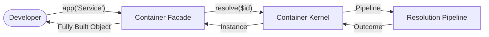

# 🗃️ Container

>
> **The user-facing Facade of the Avax Dependency Injection system.**

---

## 🗺️ High-Level Perspective

The `Container` class is the "Public Face" of the engine. It doesn't perform the complex resolution itself; instead, it
orchestrates the **Kernel** to do the heavy lifting while providing you with a clean, PSR-11 compliant API.

---

## 🌟 Quick Summary

The Container class serves as the primary public API for the dependency injection system. It exists to give developers a
clean, intuitive interface for requesting services and managing dependencies without needing to understand the intricate
internals of the **Resolution Pipeline**.

### 👨‍💻 For Humans: What This Means

Think of the Container as your application's **Personal Assistant**. Instead of you having to remember how every object
needs to be built, you just ask the Container for what you need. It's like a skilled chef: you order a dish, and it
appears perfectly assembled, saving you from having to become an expert in every recipe.

---

## 📕 Core Terminology

- **[Dependency Injection (DI)](./glossary.md#dependency-injection-di)**: Receiving objects from an external source
  rather than creating them internally.
- **[Service Identifier](./glossary.md#service-identifier)**: The unique string key (usually the class name) used to
  find a service.
- **[Resolution](./glossary.md#resolution)**: The process of building and wiring an object.
- **[Scope](./glossary.md#resolution-scope)**: A context for service lifetimes (e.g., Request scope).
- **[Service Prototype](./glossary.md#service-prototype)**: A pre-analyzed blueprint that speeds up creation.

These aren't just fancy words—they're the building blocks that make dependency injection work smoothly. Service
identifiers are like names on a restaurant menu: you don't need to know how the dish is made, just what it's called.
Resolution is the kitchen actually preparing and assembling your order. Scopes are like having separate tables for
different parties, so their food doesn't get mixed up. Prototypes are like having pre-prepped ingredients for popular
dishes. Together, they create a system where you can build complex applications without getting bogged down in the
details of how everything connects.

## 💡 The Concept: Think of It

Imagine you're at a high-end restaurant where the kitchen is incredibly complex—chefs specializing in different
cuisines, supply chains for ingredients, quality control processes—but as a diner, you only interact with the friendly
host who takes your order. The Container is that host: you tell it what you want (a service identifier), and it
coordinates all the behind-the-scenes complexity to deliver exactly what you need, perfectly prepared with all its
dependencies in place.

### 👨‍💻 Concepts: For Humans

This analogy shows why the Container exists: to be your interface to complexity. Just as you trust a restaurant to
handle the intricacies of food preparation, you trust the Container to handle the intricacies of object creation. It
frees you to focus on your application's logic rather than its plumbing.

## 📖 The Story: Practical Example

Before the Container existed, developers had to manually create every object and pass all its dependencies. Imagine
building a web application where your UserController needs a UserRepository, which needs a DatabaseConnection, which
needs configuration settings. Without dependency injection, your controller constructor might look like:
`new UserController(new UserRepository(new DatabaseConnection(new Config())))`. If any dependency changed, you had to
update everywhere it was used. With the Container, you simply call `$container->get('user_controller')`.

### 👨‍💻 Story: For Humans

This story illustrates the real problem the Container solves: the cascade of manual object creation that makes code
brittle and hard to change. It's like the difference between having to build your own car from scratch every time you
want to drive.

## 👶 For Dummies: Deep Dive

Let's break this down step by step like you're learning to cook for the first time:

1. **The Problem**: Objects need other objects to work, like a cake needs flour, eggs, and sugar.
2. **The Container's Job**: It's like a smart pantry that knows recipes and automatically gathers ingredients.
3. **How You Use It**: You just say "give me a cake" by calling `$container->get('cake')`.
4. **What Happens Inside**: The Container looks up the recipe, gets the flour, and bakes it.

### 👨‍💻 Dummies: For Humans

The Container isn't magic—it's a well-designed tool that follows clear rules. Think of it as a helpful assistant who
remembers all the complicated setup steps so you don't have to.

## ⚙️ How It Works (Technical)

The Container acts as a facade that delegates all operations to a `ContainerKernel` instance. When the container is
constructed, it receives a fully configured kernel that handles the actual dependency resolution logic.

### 👨‍💻 Mechanics: For Humans

Under the hood, the Container is like a customer service desk. When you ask for something, the clerk (the Container)
doesn't personally go into the warehouse. Instead, they pick up the phone and call the warehouse manager (the Kernel).

## 🛠️ Methods

>
> **Interactive API Map**
>
> - [get($id)](#get) — The main resolution path.
> - [has($id)](#has) — Existence check.
> - [make($abstract, $parameters)](#make) — Fresh instance.
> - [call($callable, $parameters)](#call) — Auto-injection call.
> - [injectInto($target)](#injectinto) — Retrofit injection.
> - [inspectInjection($target)](#inspectinjection) — X-Ray analysis.
> - [beginScope() / endScope()](#scopes) — Lifecycle management.
> - [exportMetrics()](#exportmetrics) — Telemetry export.

### For Humans: What This Means

When you’re trying to use or debug this file, this is the part you’ll come back to. It’s your “what can I call, and what
happens?” cheat sheet.

### Method: `get(string $id): mixed`

#### ⚙️ Technical: get()

This method serves as the primary entry point for retrieving fully constructed service instances.

#### 👨‍💻 For Humans: get()

When you call `get('Logger')`, you're saying: "I need a Logger, I don't care how you build it, just give it to me ready
to use."

#### 📥 Parameters: get()

- `string $id`: The unique name or class path of the service.

#### 📤 Returns: get()

- `mixed`: The living, breathing object instance.

#### ⚠️ Throws: get()

- `ResolutionException`: If something goes wrong during the assembly.
- `ServiceNotFoundException`: If you ask for something the container has never heard of.

#### 🎯 When to Use It: get()

- Inside Controllers to get your business services.
- Whenever you need the "Standard Instance" of a class.

#### 🛑 Common Mistakes: get()

- **Implicit Dependency**: Using `get()` inside a class instead of using **Constructor Injection**. This turns your
  class into a [Service Locator](../glossary.md#service-locator).

---

### Method: `bind(string $abstract, mixed $concrete = null): BindingBuilder`

#### ⚙️ Technical: bind()

Registers a transient binding in the definition store via the registrar and returns a fluent builder for tags/context.

#### 👨‍💻 For Humans: bind()

“Add this service to the menu; each time someone orders, cook a fresh one.”

#### 📥 Parameters: bind()

- `string $abstract`: Service ID.
- `mixed $concrete`: Class name, closure, or null (auto-wire).

#### 📤 Returns: bind()

- `BindingBuilder`: For further configuration.

#### ⚠️ Throws: bind()

- None directly; resolution may throw later if invalid.

#### 🎯 When to Use It: bind()

- For services that must be recreated each resolution.

#### 🛑 Common Mistakes: bind()

- Expecting singleton behavior; use `singleton()` instead.

---

### Method: `singleton(string $abstract, mixed $concrete = null): BindingBuilder`

#### ⚙️ Technical: singleton()

Registers a shared binding so the same instance is reused across scopes unless overridden.

#### 👨‍💻 For Humans: singleton()

“Make one and reuse it every time someone asks.”

#### 📥 Parameters: singleton()

- `string $abstract`: Service ID.
- `mixed $concrete`: Class name, closure, or null.

#### 📤 Returns: singleton()

- `BindingBuilder`: For further configuration.

#### ⚠️ Throws: singleton()

- None directly; resolution may throw later if invalid.

#### 🎯 When to Use It: singleton()

- For stateless or expensive-to-create services (loggers, clients).

#### 🛑 Common Mistakes: singleton()

- Mutating shared state unintentionally; ensure thread-safety in long-running contexts.

---

### Method: `instance(string $abstract, object $instance): void`

#### ⚙️ Technical: instance()

Stores a prebuilt object as a singleton definition via the registrar.

#### 👨‍💻 For Humans: instance()

“Use this exact object for everyone; don’t construct a new one.”

#### 📥 Parameters: instance()

- `string $abstract`: Service ID.
- `object $instance`: The ready-made instance.

#### 📤 Returns: instance()

- `void`

#### ⚠️ Throws: instance()

- None directly.

#### 🎯 When to Use It: instance()

- For externally created objects (config bags, external clients) you want the container to reuse.

#### 🛑 Common Mistakes: instance()

- Forgetting to bind aliases for the same object when needed; add additional `instance()` calls if multiple IDs should
  resolve to it.

### Method: `has(string $id): bool`

#### ⚙️ Technical: has()

Determines if a service identifier can be resolved without constructing it. It checks
the [Definition Store](./glossary.md#definition-store) and the current **Scope**.

#### 👨‍💻 For Humans: has()

It's like checking if a restaurant has your favorite dish on the menu before you sit down. It returns `true` if it's
available, `false` if not.

#### 📥 Parameters: has()

- `string $id`: The service name to check.

#### 📤 Returns: has()

- `bool`: `true` if it exists.

#### ⚠️ Throws: has()

- None. This is a "Safe" call.

---

### Method: `make(string $abstract, array $parameters = []): object`

#### ⚙️ Technical: make()

Creates a **Fresh Instance** of a service, bypassing any [Singleton](./glossary.md#singleton-pattern) cache.

#### 👨‍💻 For Humans: make()

While `get()` might give you a reused object, `make()` always builds a brand new one from
the [Blueprint](./glossary.md#service-prototype).

#### 📥 Parameters: make()

- `string $abstract`: The class or service ID.
- `array $parameters`: Optional custom constructor arguments.

#### 📤 Returns: make()

- `object`: A brand new instance.

---

### Method: `call(callable|string $callable, array $parameters = []): mixed`

#### ⚙️ Technical: call()

Invokes a function or method with automatic [Dependency Injection](./glossary.md#dependency-injection-di).

#### 👨‍💻 For Humans: call()

You give the container a function, and it automatically finds and "hands" all the parameters that function needs to run.

#### 📥 Parameters: call()

- `callable|string $callable`: The code to run.
- `array $parameters`: Manual overrides for specific arguments.

#### 📤 Returns: call()

- `mixed`: The result of the callable's execution.

---

### Method: `injectInto(object $target): object`

#### ⚙️ Technical: injectInto()

Performs [Property Injection](./glossary.md#dependency-injection-di) into an existing object.

#### 👨‍💻 For Humans: injectInto()

If you have an object that wasn't created by the container, you can "retrofit" it with dependencies here.

#### 📥 Parameters: injectInto()

- `object $target`: The object to inject dependencies into.

#### 📤 Returns: injectInto()

- `object`: The same object, but now with its dependencies injected.

---

### Method: `inspectInjection(object $target): InjectionReport`

#### ⚙️ Technical: inspectInjection()

Analyzes an object's injection points without performing actual injection.

#### 👨‍💻 For Humans: inspectInjection()

It's like a X-ray for your object. It shows you every "socket" where a dependency could be plugged in.

#### 📥 Parameters: inspectInjection()

- `object $target`: The object to inspect.

#### 📤 Returns: inspectInjection()

- `InjectionReport`: An object detailing potential injection points.

---

### Method: `beginScope(): void / endScope(): void`

#### ⚙️ Technical: scopes

Manages the lifecycle of [Resolution Scopes](./glossary.md#resolution-scope).

#### 👨‍💻 For Humans: scopes

`beginScope()` opens a new temporary "room" for your request. `endScope()` cleans up everything in that room.

#### 📥 Parameters: scopes

- None.

#### 📤 Returns: scopes

- `void`.

---

### Method: `exportMetrics(): string`

#### ⚙️ Technical: exportMetrics()

Exports [Telemetry](./glossary.md#telemetry-component) data about all resolutions that occurred.

#### 👨‍💻 For Humans: exportMetrics()

This is the "Black Box" flight data. It tells you exactly how many objects were built and how many milliseconds it took.

#### 📥 Parameters: exportMetrics()

- None.

#### 📤 Returns: exportMetrics()

- `string`: A JSON or other formatted string containing telemetry data.

## Architecture Role

The Container sits at the top of the component hierarchy, serving as the main API boundary. It depends on
ContainerKernel for implementation details but exposes a stable, simple interface. Other components like Features,
Guard, and Observe depend on the Container for integration points. The container defines the component's public contract
while delegating complex logic to specialized subsystems. This separation allows the core API to remain stable while
internals evolve.

### For Humans: Container Role

In the component's "org chart," the Container is the CEO— the public face that everyone interacts with. It delegates the
real work to expert managers (the kernel and its subsystems) but maintains control over the overall direction. This
structure means you can trust the Container's interface to stay consistent even as the internal team gets reorganized
for better efficiency.

## Risks, Trade-offs & Recommended Practices

## Why This Design (And Why Not Others)

## Technical Explanation

This public `Container` API is intentionally designed as a thin facade over a more explicit kernel and pipeline:

- **Why traits weren’t used**: traits tend to hide behavior and blur ownership. Here, the goal is to keep resolution
  behavior *discoverable* (you can point to the class that owns it) and *testable* (you can replace collaborators).
- **Why static containers were avoided**: static state makes lifetimes and scopes vague, encourages hidden dependencies,
  and makes tests bleed into each other. This container treats state as runtime-managed and explicit.
- **Why Service Locator is rejected**: a container can *become* a service locator if you call `get()` everywhere. The
  design treats the container as an application boundary tool (composition root) and pushes domain code toward
  constructor injection.

Trade-offs accepted intentionally:

- More indirection (facade → kernel → pipeline) to get clearer phases and better observability
- More types (contracts/steps/strategies) to keep responsibilities small and replaceable

### For Humans: Design Philosophy

The design tries to stop “dependency injection” from turning into “magic”. You get more files, but you also get clearer
answers: *who decided this*, *when did it happen*, and *why did it fail*.

**Risk**: Over-reliance on the container can lead to service locator anti-pattern where classes become tightly coupled
to the container itself.

**Why it matters**: This defeats the purpose of dependency injection by creating a new form of tight coupling.

**Design stance**: The container should be used at application boundaries (controllers, factories) rather than deep in
business logic.

**Recommended practice**: Use constructor injection for business objects and reserve container calls for composition
root scenarios.

**Risk**: Scope leaks can cause memory issues in long-running applications.

**Why it matters**: Services intended for request scope might persist across requests, leading to memory bloat and
potential security issues.

**Design stance**: Always pair `beginScope()` with `endScope()` using try/finally blocks.

**Recommended practice**: Use scope guards or middleware to ensure scopes are properly closed even when exceptions
occur.

**Risk**: Complex resolution logic can mask performance issues.

**Why it matters**: Deep dependency graphs or circular references can cause resolution timeouts or stack overflows.

**Design stance**: Prefer shallow dependency graphs and use lazy resolution where possible.

**Recommended practice**: Use prototyping and caching for frequently resolved services, and monitor resolution metrics.

### For Humans: Risks Summary

Like any powerful tool, the Container can cause problems if misused. It's great for its intended purpose—managing
dependencies at application edges—but becomes problematic when used as a crutch throughout your code. Think of it as a
credit card: fantastic for big purchases you plan for, but dangerous for impulse buys. The key is using it strategically
rather than everywhere.

## Related Files & Folders

**ContainerKernel**: The core implementation that handles all container operations. You encounter it when debugging
resolution issues or extending container functionality. It exists to encapsulate the complex resolution logic away from
the public API.

**DefinitionStore**: Repository for service definitions and configurations. You interact with it when registering
services or inspecting what services are available. It provides the data layer for the container's knowledge of how to
build objects.

**ScopeManager**: Handles scope lifecycle and nesting. You use it when implementing custom scoping logic or debugging
scope-related issues. It ensures services have appropriate lifetimes in different contexts.

**ResolutionPipeline**: Orchestrates the step-by-step object creation process. You encounter it when optimizing
performance or adding custom resolution steps. It defines the sequence of operations needed to fully resolve a service.

**Config/**: Contains configuration classes that define container behavior. You modify these when customizing how the
container operates globally. They provide the settings that influence all container operations.

**Features/**: Houses advanced capabilities like caching, prototyping, and specialized injection. You explore this when
you need capabilities beyond basic dependency injection. It extends the container with enterprise-grade features.

### For Humans: Ecosystem Summary

These related pieces are like the supporting cast in a play. The Container is the star, but it couldn't perform without
the kernel (director), definition store (script), scope manager (stage manager), and others. Each has a specific role
that becomes important when you need to customize or debug particular aspects of dependency injection.

### Method: __construct(ContainerKernel $kernel)

#### Technical Explanation: constructor()

The constructor initializes the container by injecting its primary dependency: the `ContainerKernel`. This established
the delegation pattern where the facade (Container) uses the engine (Kernel) to perform all heavy lifting. By injecting
the kernel, we allow for different kernel configurations (debug mode, custom pipelines, etc.) without changing the
container's public interface.

##### For Humans: constructor()

This is where the Container "wakes up" and gets connected to its brain (the Kernel). Without the Kernel, the Container
would just be an empty shell that doesn't know how to resolve anything. By giving it a Kernel right at the start, we
ensure it's ready to handle your requests immediately.

##### Parameters: constructor()

- `ContainerKernel $kernel`: The engine that will handle all the actual dependency resolution and orchestration.

##### Returns: constructor()

- `void`: Constructors in PHP don't return values.

##### Throws: constructor()

- None. The constructor simply stores the reference to the kernel.

##### When to Use It: constructor()

- This is called automatically by the `ApplicationBuilder` or when manually setting up the system. You provide the "
  brain" the container will use.

##### Common Mistakes (__construct)

- Trying to instantiate the container without a kernel (it's a required dependency).
- Passing an incompatible or unbooted kernel.
