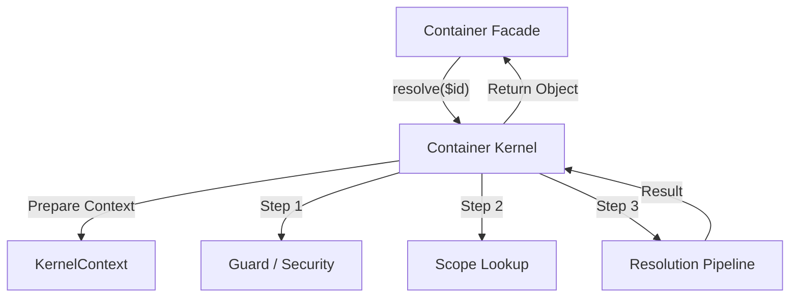

# 🧠 Container Kernel

>
> **The concentrated "Heart" of the container that orchestrates everything behind the scenes.**

---

## 🗺️ High-Level Perspective

The `ContainerKernel` is the "Engine Room". While the `Container` is the friendly steering wheel you turn, the Kernel is
where the pistons move, the fuel is injected, and the power is generated to build your objects.

---

## 🌟 Quick Summary

The ContainerKernel is the primary implementation class for the dependency injection system. It coordinates the various
subsystems—Definition Store, Scopes, and the Resolution Pipeline—to fulfill service requests while enforcing security
and architectural rules.

### 👨‍💻 For Humans: What This Means

Think of the Kernel as the **Executive Chef** of a high-end restaurant. When a waiter (the Container Facade) brings in
an order, the Chef doesn't just start cooking. They check if we have the recipe (Definitions), check if the dish is
already prepared (Scopes), assign tasks to the right kitchen stations (Pipeline), and finally plate the dish perfectly
for the diner.

---

## 📕 Core Terminology

- **[Orchestration](./glossary.md#orchestration)**: The coordination of multiple systems to achieve a single goal.
- **[Kernel Delegation](./glossary.md#delegation-pattern)**: The pattern where the Facade hands off all hard work to the
  Kernel.
- **[Subsystem](./glossary.md#subsystem)**: A specialized component (like Scopes or Telemetry) managed by the Kernel.
- **[Lifecycle](./glossary.md#service-lifecycle)**: The birth-to-death journey of the Kernel itself.

These terms define the Kernel's leadership role. Orchestration is its daily job, delegation is why it exists, subsystems
are its expert team members, and lifecycle is its time on the job. Without the Kernel, these specialized parts would be
like musicians without a conductor.

## 💡 Concept: Think of It

Imagine the "Mission Control" center for a space launch. There are specialists for fuel, weather, communication, and
trajectory. The Kernel is the Flight Director who listens to all of them and makes the final go/no-go decisions to
ensure a successful launch.

### 👨‍💻 Concepts: For Humans

This analogy shows why the Kernel is central: it's about **Coordination**. It's the only class that sees the "Big
Picture" of how all the components work together.

## 📖 Story: Practical Example

Before we had a separate Kernel, the `Container` class was 2,000 lines long and impossible to test. By moving the "
Brain" into the Kernel, we can now swap out the entire engine (e.g., for a "Debug Kernel") without the application even
knowing.

---

## 🛠️ Methods

>
> **Interactive API Map**
>
> - [get()](#get) — Main public entry.
> - [has()](#has) — Existence check.
> - [resolve()](#resolve) — Standard resolution.
> - [resolveContext()](#resolvecontext) — Advanced resolution.
> - [scopes()](#scopes) — Access Scope Manager.
> - [telemetry()](#telemetry) — Access Telemetry.
> - [inspectInjection()](#inspectinjection) — Metadata analysis.

### Method: `get(string $id): mixed`

#### ⚙️ Technical: get()

The primary entry point that transforms a simple string ID into a living object, handling all caching and orchestration.

##### 👨‍💻 For Humans: get()

"Get me a Logger instance. I don't care how, just do it."

---

### Method: `has(string $id): bool`

#### ⚙️ Technical: has()

Checks if a service can be resolved without actually resolving it.

---

### Method: `resolve(string $id): mixed`

#### ⚙️ Technical: resolve()

The "Internal" resolution path used when we *know* we need to build a new object.

---

### Method: `resolveContext(KernelContext $context): mixed`

#### ⚙️ Technical: resolvecontext()

Advanced resolution using a pre-configured "Case File" (Context).

##### 👨‍💻 For Humans: resolvecontext()

"Here is a chart with special instructions and metadata. Resolve the service based on this."

---

### Method: `scopes(): ScopeManager`

#### ⚙️ Technical: scopes()

Returns the manager responsible for service lifetimes and singletons.

---

### Method: `telemetry(): Telemetry`

#### ⚙️ Technical: telemetry()

Returns the "Black Box" recorder for performance monitoring.

---

### Method: `inspectInjection(object|null $target): InjectionReport`

#### ⚙️ Technical: inspectinjection()

Analyzes an object's injection requirements; throws when invoked without a target.

---

## 🏗️ Architecture Role

The Kernel is the central nexus of the Foundation layer. It connects the API (Container) to the implementation (
Pipeline/Scopes) and ensures everything follows the rules defined in `KernelConfig`.

### 👨‍💻 Architecture: For Humans

In the container's "Org Chart," the Kernel is the **Chief Operating Officer (COO)**. While the CEO (Container) talks to
the public, the COO makes sure the factories are running, the inventory is stocked, and the product is being shipped on
time.
