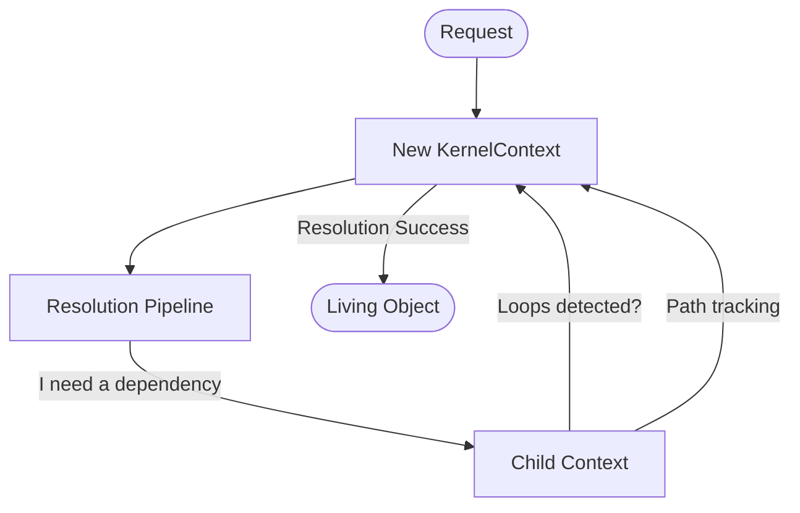

# 📄 Kernel Context
>
> **The "Case File" that tracks the state and story of every resolution journey.**

---

## 🗺️ High-Level Perspective

The `KernelContext` is the "State Machine" of the container. It's an object that travels with your resolution request, holding onto its breadcrumbs, metadata, and eventually the finished instance.

---

## 🌟 Quick Summary

The KernelContext is the "Communication Hub" and "Memory" of the dependency resolution process. It carries the service identifier, tracks the resolution path to detect circular dependencies, and provides a metadata store for inter-step communication.

### 👨‍💻 For Humans: What This Means

Think of the KernelContext as a **Doctor's Chart**. When a patient (a service request) enters the clinic (the container), a new chart is created. This chart follows the patient to every station—reception, the nurse, the doctor, the lab. Each station reads what was written before and adds new notes. By looking at the chart, the staff knows where the patient has been, what's been discovered so far, and eventually, the final diagnosis (the resolved object).

---

## 📕 Core Terminology

- **[Service Identifier](./glossary.md#service-identifier)**: The ID of the service currently being resolved.
- **[Resolution Path](./glossary.md#resolution-flow)**: The trail of parents and children that led to this request.
- **[Circular Dependency Check](./glossary.md#circular-dependency)**: The automated check that prevents stack overflows.
- **[Resolution Metadata](./glossary.md#resolution-metadata)**: Temporary notes stored for the duration of the request.
- **[Child Context](./glossary.md#nested-resolution)**: A smaller "Case File" for building a dependency of the main service.

These operational terms define the "Case File" mechanics. The service identifier is like the patient's name on the chart, the resolution path is their medical history, the circular dependency check is the safety protocol that prevents infinite loops, and metadata are the detailed lab notes shared between doctors. Together, they ensure that every resolution is safe and documented.

## 💡 Concept: Think of It

Imagine you're solving a complex puzzle. You have a notepad where you write down which pieces you're currently looking for. If you realize you're looking for Piece A because you need Piece B, and Piece B needs Piece A... you stop! That's what the Context does: it keeps the "Looking For" list and raises a red flag if you start chasing your own tail.

### 👨‍💻 Concepts: For Humans

This analogy shows why Context exists: to provide a memory and a map. Without it, the Container would be "forgetful," potentially getting lost in recursive loops or losing track of progress.

## 📖 Story: Practical Example

Before we had Context, passing data between resolution steps meant using messy global state or huge parameter lists. Now, if a `Guard` step needs to tell a `Build` step "this service is restricted," it just puts a note in the Context.

### 👨‍💻 Story: For Humans

This story illustrates the primary problem Context solves: shared state management. It's like a baton passed in a relay race, where each runner (step) can see what the previous runners did.

## 👶 For Dummies: Deep Dive

Let's break this down like a treasure hunt:

1. **The Problem**: You need a map and a bag to store clues as you find them.
2. **The Context's Job**: It is the map (where we've been) and the bag (what we found).
3. **How You Use It**: You carry it from clue to clue until you find the treasure.
4. **Safety First**: If the map shows you're walking in a circle, it tells you to stop.

### 👨‍💻 Dummies: For Humans

The Context isn't the "Worker"—it's the "Information Carrier." It doesn't do the resolution itself; it just makes sure everyone who *does* the work has all the facts.

## ⚙️ How It Works (Technical)

The `KernelContext` is a linked-list structure. Every time the container needs to resolve a dependency for another service, it calls `child()`, which creates a new context pointing back to its parent. This allows for deep tree traversal without complex management.

### 👨‍💻 Mechanics: For Humans

Under the hood, Context is like those nesting Russian dolls. Each doll (dependency) lives inside its parent, but they all know who their parent is.

---

## 🛠️ Methods
>
> **Interactive API Map**
>
> - [child()](#child) — Create nested context.
> - [getInstance()](#getinstance) — Retrieve resolved object.
> - [contains()](#contains) — Loop detection check.
> - [getPath()](#getpath) — Resolution breadcrumbs.
> - [getDepth()](#getdepth) — Nesting level.
> - [setMeta()](#setmeta) — Store notes.
> - [getMeta()](#getmeta) — Read notes.
> - [hasMeta()](#hasmeta) — Existence check.
> - [resolvedWith()](#resolvedwith) — Finish job.

### Method: `child(string $serviceId, array $overrides = []): self`

#### ⚙️ Technical: child()

Creates a new, nested context that maintains a link to the current context as its parent.

##### 👨‍💻 For Humans: child()

"I'm resolving Class A, but now I realize I need Class B. Hand me a new chart for Class B, and link it to this one."

##### 📥 Parameters: child()

- `string $serviceId`: The ID of the dependency we're about to fetch.
- `array $overrides`: Custom parameters for this specific dependency.

##### 📤 Returns: child()

- `self`: A fresh, linked context instance.

---

### Method: `getInstance(): mixed`

#### ⚙️ Technical: getInstance()

Retrieves the final resolved object instance stored in this context.

##### 👨‍💻 For Humans: getInstance()

"Give me the finished product we were working on."

##### 📤 Returns: getInstance()

- `mixed`: The living object (or null if not yet resolved).

---

### Method: `contains(string $serviceId): bool`

#### ⚙️ Technical: contains()

Checks the entire parent chain to see if a specific ID is already in the middle of being resolved.

##### 👨‍💻 For Humans: contains()

"Wait, are we already working on this? Don't let me start Class A if its parent is already waiting for Class A."

##### 📤 Returns: contains()

- `bool`: `true` if a loop is found.

---

### Method: `getPath(): string`

#### ⚙️ Technical: getPath()

Returns a string representation of the full resolution chain (e.g., `A -> B -> C`).

##### 👨‍💻 For Humans: getPath()

"Show me the trail from the original request to where we are now."

##### 📤 Returns: getPath()

- `string`: The human-readable path.

---

### Method: `getDepth(): int`

#### ⚙️ Technical: getDepth()

Returns the current nesting level of the resolution.

##### 👨‍💻 For Humans: getDepth()

"How many levels deep are we in the dependency tree?"

---

### Method: `setMeta(string $namespace, string $key, mixed $value): void`

#### ⚙️ Technical: setMeta()

Attaches arbitrary metadata to the context.

##### 👨‍💻 For Humans: setMeta()

"Write a sticky note in the 'Pipeline' folder named 'SecurityStatus' that says 'Passed'."

---

### Method: `getMeta(string $namespace, string $key, mixed $default = null): mixed`

#### ⚙️ Technical: getMeta()

Retrieves saved notes.

##### 👨‍💻 For Humans: getMeta()

"Look for the note in the 'Pipeline' folder named 'SecurityStatus'. If it's not there, assume 'Unknown'."

---

### Method: `hasMeta(string $namespace, string $key): bool`

#### ⚙️ Technical: hasMeta()

Checks if a specific note exists.

---

### Method: `resolvedWith(mixed $instance): void`

#### ⚙️ Technical: resolvedWith()

Marks the resolution as complete by providing the final object.

##### 👨‍💻 For Humans: resolvedWith()

"Job's done. Here is the final object. Seal the file."

---

## 🏗️ Architecture Role

KernelContext works with the entire pipeline ecosystem. The pipeline uses it as the communication medium, steps interact with it during execution, and the kernel creates it to start the journey. It's the "Thread-Safe" state carrier of the engine.

### 👨‍💻 Ecosystem: For Humans

In the container's world, the Pipeline is the **Road**, the Kernel is the **Manager**, and the Context is the **Car**. The car carries all the passengers and luggage (data) from one end of the road to the other.
