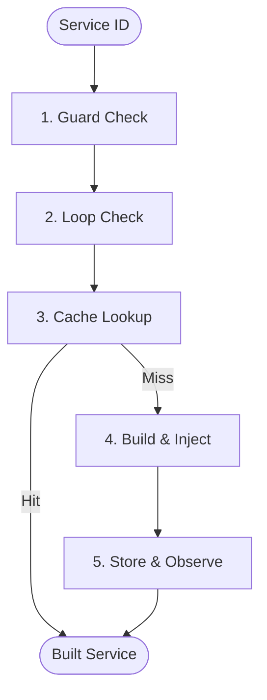

# ⚙️ Resolution Pipeline
>
> **The specialized "Assembly Line" where every service is systematically built and verified.**

---

## 🗺️ High-Level Perspective

The `ResolutionPipeline` is the "Workhorse" of the system. It doesn't make decisions—it just executes a series of **Steps** in a fixed order to ensure every object is created safely and consistently.

---

## 🌟 Quick Summary

The ResolutionPipeline orchestrates a sequence of [Kernel Steps](../glossary.md#kernel-step) to resolve a service. Each step performs a single, focused operation on the `KernelContext`, allowing for a modular and highly extensible resolution process.

### 👨‍💻 For Humans: What This Means

Imagine a **Subway Sandwich Shop**. There is a clear line: first you pick your bread, then your meat, then cheese, then veggies, then sauce. The ResolutionPipeline is that assembly line. If the guy at the bread station (Step 1) sees we are out of bread, he stops the line immediately. If everything goes well, you get your sandwich at the end, exactly how you wanted it.

---

## 📕 Core Terminology

- **[Kernel Step](./glossary.md#kernel-step)**: A single station in the assembly line (e.g., "Instantiation").
- **[Conveyor Belt](./glossary.md#pipeline-pattern)**: The mechanism that moves the Context from one step to the next.
- **[Early Exit](./glossary.md#terminal-step)**: When a step (like Cash Lookup) finishes the job early and skips the rest of the line.
- **[Atomic Build](./glossary.md#atomic-execution)**: The rule that the object isn't "done" until it reaches the very end of the line.

These terms define the pipeline's operational rules. Kernel steps are the individual tasks, the conveyor belt is the order they happen in, early exit is a shortcut for efficiency, and atomic build is your guarantee of quality. Together, they turn complex object creation into a reliable manufacturing process.

## 💡 Concept: Think of It

Think of a **Car Wash**. Your car moves through brushes, soap, water, and dryers. Each machine does one job perfectly. You don't have one giant machine that does everything—you have a line of specialists.

### 👨‍💻 Concepts: For Humans

This analogy explains why we use a Pipeline: **Reliability**. By breaking "Resolution" into 5-10 small, simple steps, we make it much easier to debug and improve without breaking the whole system.

## 📖 Story: Practical Example

Before the Pipeline, adding "Logging" to the container required changing the heart of the code. Now, we just add a `LoggingStep` to the end of the pipeline. It takes 5 minutes instead of 5 hours.

---

## 🛠️ Methods
>
> **Interactive API Map**
>
> - [run()](#run) — Start the line.
> - [withStep()](#withstep) — Add a worker.
> - [withSteps()](#withsteps) — Batch add workers.
> - [count()](#count) — Line length.

### Method: `run(KernelContext $context): void`

#### ⚙️ Technical: run()

Executes all configured steps in sequence, passing the context to each.

##### 👨‍💻 For Humans: run()

"Start the conveyor belt for this specific request."

---

### Method: `withStep(KernelStep $step): self`

#### ⚙️ Technical: withstep()

Adds a single station to the assembly line.

---

### Method: `withSteps(array $steps): self`

#### ⚙️ Technical: withsteps()

Adds a whole group of stations to the line at once.

---

### Method: `count(): int`

#### ⚙️ Technical: count()

Returns how many stations are currently in the line.

---

## 🏗️ Architecture Role

The Pipeline is the bridge between the **Kernel** (which manages the state) and the **Actions** (which do the actual work). It ensures that no action happens out of order.

### 👨‍💻 Ecosystem: For Humans

In our "Subway" analogy, the Pipeline is the **Store Layout**. It ensures you don't try to put sauce on the meat before you've even picked the bread. It keeps everything organized so the customer (the developer) always gets a perfect sandwich.
