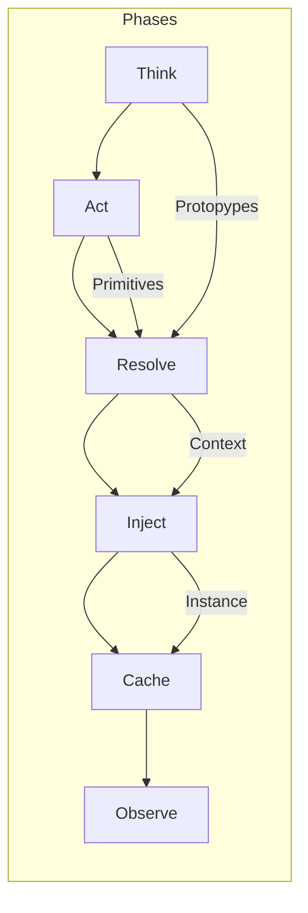
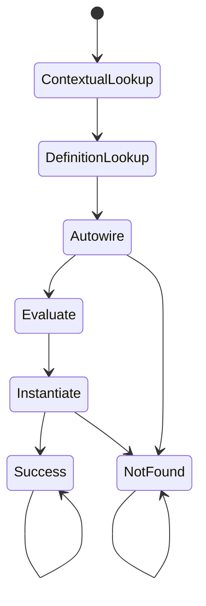
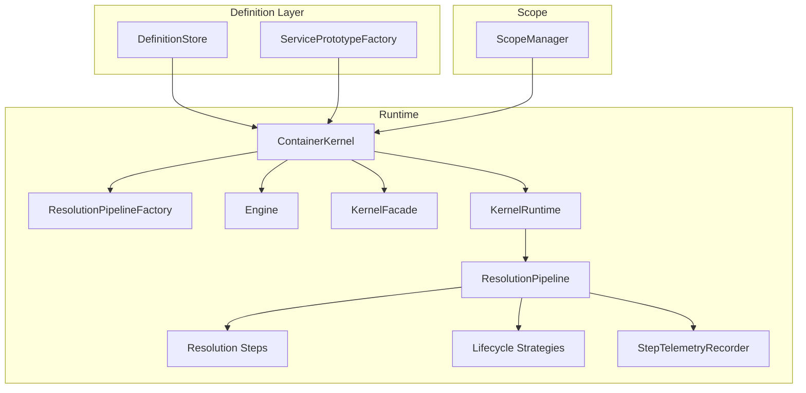

# 🗺️ Architecture Map: The Flow of Resolution

## 🌊 Everything is a Flow

The Avax Container is built as a **flow-oriented system**. Instead of hiding everything inside one giant `resolve()`
method, we model resolution as a series of staged pipeline steps. Think of it as a factory line where each station has a
specific responsibility.

---

## 🎛️ Resolution FSM (Deterministic Path)

The resolution pipeline is modeled as a strict finite state machine. Each resolution walks this path:

- **ContextualLookup → DefinitionLookup → Autowire**: Ordered discovery with no shortcuts.
- **Evaluate → Instantiate**: Normalization then construction for any class-string candidate.
- **Terminals**: `NotFound` only after a miss in Autowire/Instantiate; `Success` only after a hit.

### For Humans: What This Means

Think of a single-lane road with marked checkpoints: check special rules, then normal rules, then try to autowire; if
you find something, prep it, build it, and finish. If you miss at the last discovery or build step, you stop with a
clear “not found” sign.

---

## 🧭 C4 Glimpse (Containers & Components)

### For Humans: What This Means

The kernel is the hub; the pipeline factory assembles the execution line; runtime drives the assembled pipeline;
telemetry records what happened; definitions and prototypes feed the line; scope manages reuse.

---

## ⚠️ Risks & Assumptions (Architecture)

- **Assumption:** Single-threaded PHP runtimes avoid shared-mutable issues in the engine/pipeline; concurrency would
  require isolation.
- **Risk:** Pipeline step order changes can silently alter behavior; mitigate with explicit tests and factory docs.
- **Risk:** Telemetry overhead in dev mode; ensure sampling/conditional wiring stays off in production profiles.
- **Assumption:** Definitions/prototypes are trusted; hostile input could bypass guards—apply validation upstream.
- **Risk:** Scope misuse (missing begin/end) can leak instances; guard with kernel APIs and integration tests.

### For Humans: What This Means

We assume PHP’s usual single-request model; changing step order or leaving scopes open can break things; telemetry is
great for dev but should be controlled in prod; validate inputs before they hit the pipeline.

### 🧠 Stage 1: Think ([Analysis](../glossary.md#reflection-api))

**Goal**: Understand *what* needs to be built before we touch any code.

- **Where it lives**: `Features/Think/`
- **Key Logic**: We use the [Reflection API](https://en.wikipedia.org/wiki/Reflection_(computer_programming)) to look at
  types and attributes (`#[Inject]`) to create a **Prototype**.
- **Why?**: To remove reflection chaos and create a stable, cacheable plan.

### 🎭 Stage 2: Act (Primitives)

**Goal**: Provide the "verbs" to perform discrete operations.

- **Where it lives**: `Features/Actions/`
- **Key Logic**: Small, focused classes that do one thing well—`Instantiate`, `Invoke`, `InjectDependencies`.
- **Why?**: So the Kernel doesn't have to keep re-inventing how to "create an object".

### ⚙️ Stage 3: Resolve ([Orchestration](../glossary.md#resolution))

**Goal**: The heart of the machine—executing the plan.

- **Where it lives**: `Core/Kernel/`
- **Key Logic**: The **Resolution Pipeline** runs a sequence of steps.
- **Why?**: To make the "Life of a Request" explicit, testable, and observable.

### 🧪 Stage 4: Inject ([Finishing](../glossary.md#dependency-injection-di))

**Goal**: Apply dependencies to properties and methods.

- **Where it lives**: `Features/Actions/Inject/`
- **Key Logic**: After the object is born, we "wire" it up according to the prototype.
- **Why?**: To separate "birth" from "wiring", allowing for deep customization.

### 🏦 Stage 5: Cache ([Stability](../glossary.md#resolution-scope))

**Goal**: Remember results and manage lifetimes.

- **Where it lives**: `Features/Operate/Scope/`
- **Key Logic**: The **Scope Manager** decides if you get a new instance or a reused one.
- **Why?**: To prevent memory leaks and ensure singletons behave.

### 🔭 Stage 6: Observe ([Visibility](../glossary.md#telemetry-component))

**Goal**: Record everything for the developer.

- **Where it lives**: `Observe/`
- **Key Logic**: **Telemetry** and **Timeline** capture every micro-second.
- **Why?**: Because "it works" isn't enough—you need to know *how* and *how fast*.

---

## 🏗️ Folder Hierarchy Explained

| Folder       | Mental Model     | Role                                           |
|:-------------|:-----------------|:-----------------------------------------------|
| `Core/`      | **The Brain**    | The Kernel, Pipeline, and main Orchestrator.   |
| `Features/`  | **The Skills**   | Specialized logic grouped by capability.       |
| `Guard/`     | **The Security** | Logic that decides if a resolution is allowed. |
| `Observe/`   | **The Eyes**     | Monitoring, metrics, and debugging tools.      |
| `Providers/` | **The Bridges**  | Ready-made integrations for other components.  |

---

## 🛠️ The Architecture Choice: "Clarity over Cleverness"

We purposefully avoided certain common patterns:

- **No [Traits](https://en.wikipedia.org/wiki/Trait_(computer_programming))**: We prefer explicit objects. It's more
  files, but less mystery.
- **No Static State**: The container is a managed runtime object, making tests reliable.
- **[Composition over Inheritance](https://en.wikipedia.org/wiki/Composition_over_inheritance)**: Every step is a
  separate class you can swap.

---
> **Next Step**: Learn how a single request travels through the system in
> the [Resolution Flow Guide](./concepts/resolution-flow.md).
