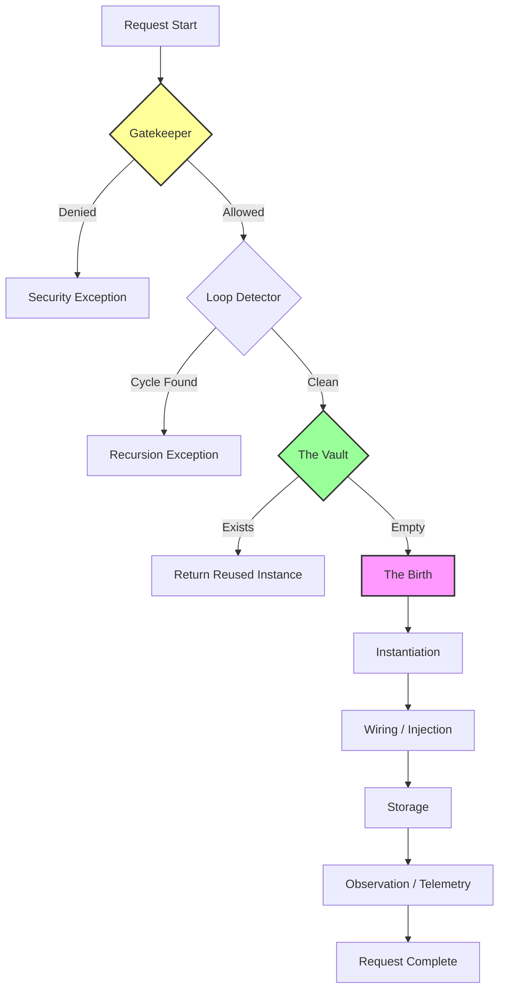

# 🌊 The Life of a Service Request

>
> **Ever wondered what happens when you call `app(Logger::class)`? Let's take a journey through the "Golden Path" of
resolution.**

---

## 🗺️ The Path at a Glance

Below is the visual map of how a request travels from a simple string ID to a fully living PHP object.

---

## 🎭 The Story: From Request to Reality

Resolution is isn't just "finding a class." It's a carefully choreographed assembly line that ensures every service is
born safe, wired correctly, and remembered when needed.

### 🛑 Station 1: The Gatekeeper ([Identify & Guard](../glossary.md#security-policies))

Before we move a single byte, we check the rules.

- **The Question**: "Are you allowed to have this? Does it even exist?"
- **The Logic**: We look up the definition. If you're trying to resolve something dangerous or forbidden by a `Guard`,
  the journey ends here.
- **Learn More**: See [Security and Policies](../glossary.md#security-policies).

### 🔄 Station 2: The Loop Detector ([Circular Check](../glossary.md#circular-dependency))

We look up the "family tree" of the request.

- **The Question**: "Is Logger waiting for Database, which is waiting for Logger?"
- **The Logic**: The `KernelContext` traverses its parents. If it finds a circle (recursion), it aborts to prevent
  a [Stack Overflow](https://en.wikipedia.org/wiki/Stack_overflow).
- **Learn More**: [Circular Dependency Pattern](https://en.wikipedia.org/wiki/Circular_dependency).

### 🏦 Station 3: The Vault ([Scope Retrieval](../glossary.md#resolution-scope))

We check if we already built this before.

- **The Question**: "Is this a **Singleton**? Did we resolve it earlier in this request?"
- **The Logic**: We check the **Scope Manager**. If it's there, we take a "Shortest Path" exit and give you the existing
  object. **Fast and efficient.**
- **Learn More**: [Singleton Pattern](https://en.wikipedia.org/wiki/Singleton_pattern).

### 🏗️ Station 4: The Birth ([Instantiation](../glossary.md#instantiation))

If it's new, we build it.

- **The Question**: "How do I assemble this specific object?"
- **The Logic**: We use the [Service Prototype](../glossary.md#service-prototype) (the blueprint) to find constructor
  arguments. We recursively resolve those dependencies until the main object is born.
- **Learn More**: [Dependency Injection (DI)](https://en.wikipedia.org/wiki/Dependency_injection).

### 🧪 Station 5: The Wiring ([Injection](../glossary.md#dependency-injection-di))

Now that the object is alive, it needs its equipment.

- **The Question**: "Are there properties or methods marked with `#[Inject]`?"
- **The Logic**: We "wire" the extra dependencies into the object
  using [Property Injection](https://en.wikipedia.org/wiki/Dependency_injection#Setter_injection). This is separate from
  birth to handle complex circular references.

### 📝 Stage 6: The Record (Storage & Observation)

Finally, we finish the paperwork.

- **The Question**: "Should I remember this? How long did it take?"
- **The Logic**: We save the instance in the correct **Scope** and record the **Telemetry** for
  your [Black Box recorder](../Observe/index.md).

---

## 🛠️ The Mechanics: Who Does the Work?

| Component    | Responsibility | Analogous To            |
|:-------------|:---------------|:------------------------|
| **Kernel**   | Coordination   | The Orchestra Conductor |
| **Pipeline** | Sequence       | The Assembly Line       |
| **Context**  | State          | The Case File           |
| **Actions**  | Primitives     | The Tools in the Box    |

---

## 🧭 Navigating the Code

- **Where the flow is defined**: `Core/Kernel/ResolutionPipelineFactory.php`
- **Where the steps live**: `Core/Kernel/Steps/`
- **Where the "Verbs" are**: `Features/Actions/`

---
> **Ready to go deeper?** Explore [Scopes & Lifetimes](./scopes.md) to understand how we remember what we built.
