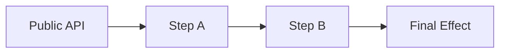

```markdown
# Enterprise-Grade System Code Review
## Architecture, Design, and Foundational Assessment

> **Purpose**
>
> This document defines a **result-oriented, enterprise-grade code review** process for **core systems**
> (frameworks, platforms, infrastructure components, SDKs, shared libraries).
>
> This is **not** a PR review.
> The output of this review must enable a **clear technical decision** about the system’s future.

---

## Review Contract

### What This Review IS
- System-level analysis
- Architecture and design validation
- Foundational assumption challenge
- Performance-by-design evaluation
- Failure-mode and diagnostic surface sanity check (minimal, not a tooling deep dive)

### What This Review IS NOT
- Style or formatting review
- Line-by-line refactor suggestions
- Feature-level feedback
- Full observability or tooling audit (dashboards, vendors, agents, pipelines)

---

## Expected Final Outcomes (Non-Negotiable)

At the end of this review, we must be able to answer **unambiguously**:

1. **Is the system fundamentally sound?**
2. **Is evolution safe, or does complexity compound?**
3. **What is the correct next action?**

The review must conclude with **exactly one** of the following outcomes:

- ✅ **Keep and Improve**: system is sound, proceed with incremental evolution
- ⚠️ **Redesign**: core assumptions are stressed, targeted redesign required
- 🚨 **Rewrite Candidate**: foundational design is flawed, rewrite is rational

If the review cannot support one of these decisions, **it is incomplete**.

---

## Hard Gates (Stop Conditions)

Stop the review immediately if any of the following cannot be produced:

- A correct **as-built execution flow**
- A **primary axis** statement (central abstraction)
- A completed **responsibility and boundary map**
- A set of **system invariants** (at least 5)

---

## Review Rules (Mandatory)

1. Do **not** propose fixes in Phase 1.
2. Do **not** start from individual files.
3. Do **not** optimize before reconstructing the architecture.
4. Every finding must include:
   - **Symptom**: what is observed
   - **Root Cause**: why it exists
   - **Impact**: why it matters
   - **Evidence**: concrete pointers (files, classes, call paths, scenarios)
   - **Risk Level**: Low / Medium / High / Rewrite Risk

---

## Risk Level Definitions (Mandatory)

| Risk Level | Definition |
|---|---|
| Low | Localized issue, does not spread across boundaries, low coupling, easy to test and fix without ripple effects. |
| Medium | Crosses module boundaries or affects extension points, requires coordination, increases maintenance cost. |
| High | Impacts correctness, safety, or evolution, forces touching multiple core classes, increases systemic fragility. |
| Rewrite Risk | Indicates the system’s axis is wrong or the complexity-to-capability ratio is compounding. Requires structural change, not patching. |

---

## Standard Finding Template (Use This Format)

### Finding: <short title>
- **Symptom:** …
- **Root Cause:** …
- **Impact:** …
- **Evidence:** …
- **Risk Level:** Low / Medium / High / Rewrite Risk
- **Notes (optional):** constraints, trade-offs, why it might be acceptable

---

## Required Artifacts (Deliverables)

The review must produce these file review.md as output 
in the folder Code-Review-And-ToDo with sections:

- `ARCHITECTURE NOTES` (or this doc filled in)
- `FINDINGS` (all findings using the standard template)
- `DECISION` (final decision, max 10 sentences)
- `DECISIONS-LOG` (decision log entries, see template below)
- `NEXT STEPS` (action-oriented plan based on the decision)

NOTE: overwrite existing reviews
---

# PHASE 0: Context and Scope Gate (Mandatory)

**Goal:** Prevent wrong assumptions and opinion-based review.

### 0.1 System Identity
Fill in:
- **System Type:** library / framework / platform / infra component / SDK / shared module
- **Primary Consumers:** internal teams / public users / app layer / infra layer
- **Runtime Context:** HTTP request / CLI / worker / long-running process / mixed
- **Lifecycle:** prototype / stable core / legacy / replacement-in-progress

### 0.2 Intended Use-Cases and Anti-Use-Cases
- **Intended Use-Cases :**
  - …
- **Anti-Use-Cases (things the system explicitly should NOT do):**
  - …

### 0.3 Non-Goals
- List explicit non-goals, to prevent scope creep in review:
  - …

### 0.4 Compatibility Contract
- **Public API Stability Requirement:** strict / moderate / none
- **Backwards Compatibility:** required / optional / not required
- **Performance Budget:** expected scale and constraints (rough numbers are fine)

**Deliverable:** A filled Phase 0 section. If Phase 0 is missing, Phase 1 findings are invalid.

---

# PHASE 1: System and Architecture Review
**Goal:** Build a correct mental model of the system as it exists today.

---

## 1. System Model Reconstruction (Mandatory)

### 1.1 Actual Execution Flow (As-Built)
Reconstruct the real execution flow, ignoring documentation and intentions:

`Public API -> ? -> ? -> ? -> Final Effect`

Identify explicitly:
- Where state is **created**
- Where state is **mutated**
- Where decisions are **made**
- Where execution is **pure / mechanical**

**Deliverable:**
- One diagram (ASCII / Mermaid / external)
- A 5 to 10 line explanation titled:
  **"This is how the system actually works."**

Example Mermaid skeleton (optional):


If this cannot be produced, the review stops here.

---

## 2. Central Abstraction Identification

### 2.1 Primary Axis Rule (Mandatory)

Answer with one sentence only:

> "This system is fundamentally organized around **<PRIMARY_AXIS>**."

Examples:

- Kernel

- Pipeline

- Context

- Configuration

- Engine

- Other (explicitly name it)

### 2.2 Secondary Axis (Optional, but Controlled)

If a second axis exists, name it explicitly:

> "Secondary axis: **<SECONDARY_AXIS>** (adds complexity and must be justified)."

**Rule:** If a secondary axis exists, mark **Design Risk: Dual-axis complexity** and justify why it is necessary.

**Deliverable:**

- Primary axis sentence

- Optional secondary axis sentence + justification

---

## 3. Central Abstraction Stress Test

For the primary axis, answer Yes / No:

- Does every feature flow through it?

- Does it accumulate responsibilities over time?

- Is it harder to change than surrounding components?

**Assessment:**

- ✅ Pass: stable axis

- ⚠️ Weak: growing pressure

- 🚨 Fail: wrong axis

**Deliverable:**

- Classification (Pass / Weak / Fail)

- write clear justification(s) with evidence pointers

---

## 4. Responsibility and Boundary Mapping

Map responsibilities explicitly:

| Component | Orchestrates | Executes | Holds State | Notes |
|-----------|--------------|----------|-------------|-------|
|           |              |          |             |       |

**Red Flags:**

- One component does all three (orchestrates, executes, holds state)

- Responsibilities are inferred, not explicit

- State ownership is unclear

- Boundaries leak through "helper" backdoors

**Deliverable:**

- Completed table

- A 3 line summary:  
  **"Responsibility boundaries are: clear / stressed / violated."**

---

## 5. Pipeline and Control Flow Analysis (If Applicable)

### 5.1 Pipeline Inventory

List steps in actual execution order:

| Step | Mandatory | Conditional | Mutates State | Terminal |
|------|-----------|-------------|---------------|----------|
|      |           |             |               |          |

### 5.2 Determinism Check

Is this pipeline a formal state machine?

**Criteria for "Yes":**

- Explicit states exist

- Explicit transitions exist

- Explicit terminal and error states exist

**Deliverable:**

- Table

- Explicit answer: **Yes / No**

- If "No": mark as **Foundational Risk: Implicit ordering**

---

## 6. Mutability Audit (Mandatory)

List all mutable objects:

| Object | Scope | Lifetime | Why Mutable? | Classification                         |
|--------|-------|----------|--------------|----------------------------------------|
|        |       |          |              | Necessary / Convenience / Design Smell |

**Deliverable:**

- Table

- Summary sentence:  
  **"Mutability is: justified / excessive / misplaced."**

---

## 7. System Invariants (Mandatory)

Define invariants the system must preserve. Examples:

- Deterministic resolution under same inputs

- No hidden mutation outside the central context

- No global state access without explicit boundary

- Circular dependency handling is explicit and policy-driven

- Errors carry context and are classifiable

- Extensions cannot bypass safety rules

**Deliverable:**

- as much as possible invariants

- For each invariant, list where it is enforced (or not enforced)

Template:

| Invariant | Enforced Where | Evidence | Status                              |
|-----------|----------------|----------|-------------------------------------|
|           |                |          | Enforced / Partially / Not enforced |

---

# PHASE 2: Foundational and Critical Design Review

**Goal:** Decide whether the system’s initial assumptions were correct.

---

## 8. Routine Enterprise Design Failures

### 8.1 Framework-in-a-Framework Syndrome

Check if present:

- Excessive builders, registries, facades

- Abstractions mirroring popular frameworks without real need

- Complexity without proportional capability

**Deliverable:**

- Present / Not Present

- celar explanation(s) with evidence pointers

---

### 8.2 Abstractions Without Real Variance

Identify:

- Interfaces with a single implementation

- Extension points never exercised

- Configuration flags that mimic polymorphism

Classify each:

- Acceptable

- Premature abstraction

- Design debt

**Deliverable:**

- List + classification + evidence

---

### 8.3 "Too Clever" Design Test

Answer explicitly:

- Is the design optimized for **reading** or **writing**?

- Does usage require internal knowledge?

**Deliverable:**

- Clear / Risky / Over-engineered

- Short justification with one usage scenario

---

## 9. Configuration as Architectural Signal

Answer Yes / No:

- Has configuration become a proxy for architecture?

- Are behavioral modes encoded via flags?

- Are invalid combinations possible?

**Assessment:**

- Healthy

- Risky

- Fundamentally flawed

**Deliverable:**

- Classification + reasoning + evidence

---

## 10. Performance-by-Design Sanity Check

Answer Yes / No:

- Is caching required for acceptable performance?

- Are many objects created per request or resolve?

- Could parts be plain functions instead of objects?

- Is reflection on the hot path without mitigation?

If 2 or more are Yes, mark:  
**Design-Level Performance Risk**

**Deliverable:**

- Yes/No matrix

- Conclusion and evidence pointers

---

## 11. Failure Modes and Diagnostic Surface (Minimal, Mandatory)

This is not a tooling audit. This is a design sanity check.

Answer Yes / No:

- Are errors categorized (programmer error vs runtime error vs domain error)?

- Do exceptions include context (what, where, why)?

- Can the system explain "why a decision was made" in a minimal way (debug hooks, traces, or structured error details)?

- Are failure states explicit in the pipeline or axis?

**Deliverable:**

- Yes/No matrix

- write clear conclusion

---

## 12. Rewrite Heuristics (Mandatory, Weighted)

Check items and sum weights.

| Heuristic                                           | Weight | Checked |
|-----------------------------------------------------|--------|---------|
| Central abstraction is wrong                        | 2      | ☐       |
| Pipeline relies on implicit ordering                | 2      | ☐       |
| Configuration complexity mirrors design complexity  | 1      | ☐       |
| Usage requires explanation to avoid misuse          | 1      | ☐       |
| Performance depends on mitigation, not structure    | 1      | ☐       |
| New features require touching multiple core classes | 2      | ☐       |

**Rewrite Score:** sum of checked weights = `__`

**Interpretation:**

- Score 0 to 2: rewrite not justified by heuristics

- Score 3 to 4: redesign likely, rewrite possible depending on constraints

- Score 5+: rewrite is rational unless constraints prohibit it

**Deliverable:**

- Checked list

- Final score

- One paragraph justification referencing findings

---

# FINAL DECISION (Required)

Select exactly one:

- ✅ **Keep and Improve**

- ⚠️ **Redesign**

- 🚨 **Rewrite Candidate**

## Justification (Strict)

- Write clear human-grade sentences (how, why, where..)

- Must reference findings above (by IDs or titles)

- Must explain why this is the correct next step under the constraints

---

# NEXT STEPS (Action-Oriented)

## Constraints (Mandatory)

Define the non-negotiables for the chosen direction:

- API stability requirement: …

- Performance budget: …

- Security boundaries: …

- Time and risk tolerance: …

- Migration expectations: …

## Kill Criteria (Mandatory)

Define signals that the decision is failing:

- Example: "After 2 iterations, adding one feature still requires touching 4+ core classes"

- Example: "We cannot explain resolution decisions without deep internal knowledge"

- Example: "Caching becomes mandatory to hide design issues"

---

## If Keep and Improve

- What must not change:

    - …

- What can be incrementally evolved:

    - …

- First 3 concrete actions:

    1. …

    2. …

    3. …

## If Redesign

- Which abstraction is being redesigned:

    - …

- What remains intact:

    - …

- First 3 concrete actions:

    1. …

    2. …

    3. …

## If Rewrite Candidate

- What core idea failed:

    - …

- What the new primary axis should be:

    - …

- Migration strategy (minimum viable):

    - parallel run / adapter layer / incremental replacement

- First 3 concrete actions:

    1. …

    2. …

    3. …

---

# DECISIONS LOG (Template)

Use one entry per significant decision.

## Decision:

- **Date:** YYYY-MM-DD

- **Context:** what triggered this decision

- **Decision:** what we chose

- **Alternatives:** what we rejected and why

- **Consequences:** expected outcomes and risks

- **Evidence:** findings and references

---

> **Final Rule**
>
> A review that does not clearly determine what to do next and why  
> is not an enterprise-grade review.
